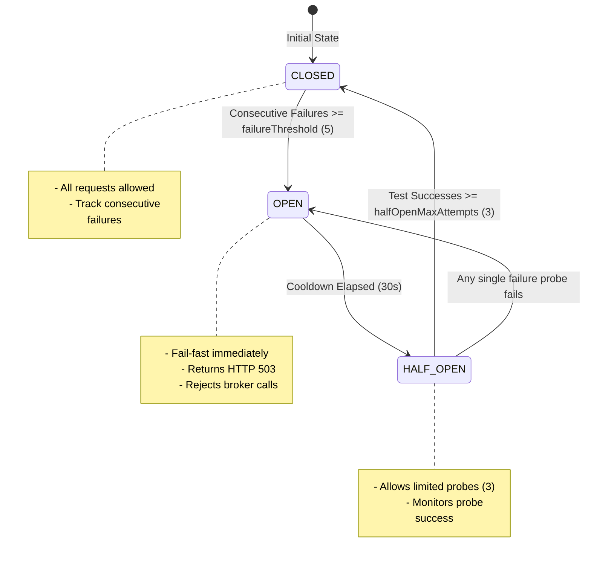

# 🚀 ObserveX: Real-Time API Hit Tracking & Monitoring System Workflow Documentation

<div align="center">

<br/>

[](https://nodejs.org)
[](https://expressjs.com)
[](https://react.dev)
[](https://vite.dev)
[](https://mongodb.com)
[](https://postgresql.org)
[](https://rabbitmq.com)

**ObserveX** is a high-throughput, multi-tenant API telemetry and monitoring solution.  
**Track hits. Aggregate metrics. Analyze latency. Secure endpoints.**

[🚀 Getting Started](#⚙️-quick-start--setup) &nbsp;&middot;&nbsp; [🏗️ System Architecture](#🏗️-system-architecture) &nbsp;&middot;&nbsp; [🌊 Core Pipelines](#🌊-event-driven-ingest-pipeline) &nbsp;&middot;&nbsp; [🔌 API Reference](#🔌-api-endpoints)

</div>

---

## 📋 Table of Contents
1. [🚀 Overview](#🚀-overview)
2. [🏗️ System Architecture](#🏗️-system-architecture)
3. [💾 Database Design](#💾-database-design)
4. [🛠️ Advanced System Design & Fault Tolerance Patterns](#🛠️-advanced-system-design--fault-tolerance-patterns)
5. [🛡️ Authentication & Authorization](#🛡️-authentication-&-authorization)
6. [🌊 Event-Driven Ingest Pipeline](#🌊-event-driven-ingest-pipeline)
7. [📊 Analytics & Aggregation Engine](#📊-analytics-&-aggregation-engine)
8. [🔌 API Endpoints](#🔌-api-endpoints)
9. [💻 Frontend Application](#💻-frontend-application)
10. [⚙️ Quick Start & Setup](#⚙️-quick-start--setup)
11. [📝 Environment Configurations](#📝-environment-configurations)

---

## 🚀 Overview

**ObserveX** is designed to capture, process, and visualize API metrics at scale. Instead of forcing application servers to block or run slow queries while logging requests, ObserveX provides a high-throughput `/api/hit` ingestion endpoint that offloads analytics asynchronously using **RabbitMQ** and segregates raw transactional logs (**MongoDB**) from aggregated metrics (**PostgreSQL**).

### ✨ Key Features
- **⚡ Asynchronous Telemetry Ingestion**: Decouples API hit logging from analytics using RabbitMQ queues with publisher confirms.
- **🛡️ Resilient Fallback Design**: Ensures that if database updates fail, raw records are protected, and client applications receive non-blocking immediate feedback.
- **⏱️ Circuit Breaking & Retries**: Employs exponential backoff, jitter, and circuit breaker patterns to survive high load and transient queue downtime.
- **🔑 Granular API Key Management**: Multi-tenant key scopes including environments, allowed IP/origins, service limits, and permissions.
- **📊 Interactive Dashboards**: Real-time traffic, latency, and status charts using React, TanStack Query, and ApexCharts.

---

## 🏗️ System Architecture

ObserveX utilizes a split-database approach: **MongoDB** acts as the high-write transactional store for raw logging and client settings, while **PostgreSQL** handles time-bucketed aggregation queries for high-performance dashboard reads.

```
                  ┌────────────────────────────────────────┐
                  │          Client Applications           │
                  └──────────────────┬─────────────────────┘
                                     │ 
                        POST /api/hit (with API Key)
                                     ▼
                  ┌────────────────────────────────────────┐
                  │          Express Ingest App            │ (Port 5000)
                  │   - Validate API Key (MongoDB)         │
                  │   - Rate Limit (Express Rate Limit)    │
                  │   - Circuit Breaker check              │
                  └──────────────────┬─────────────────────┘
                                     │ Asynchronous Publish
                                     ▼
                  ┌────────────────────────────────────────┐
                  │               RabbitMQ                 │ (Queue: api_hits)
                  └──────────────────┬─────────────────────┘
                                     │ Consumer Subscription
                                     ▼
                  ┌────────────────────────────────────────┐
                  │          Background Consumer           │
                  │   - Idempotency & Zod Validation       │
                  │   - Save Raw Hits to MongoDB           │
                  │   - Fallback-Safe Upsert to Postgres   │
                  └───────────┬──────────────────┬─────────┘
                              │                  │
                              ▼                  ▼
                     ┌──────────────┐   ┌──────────────┐
                     │   MongoDB    │   │  PostgreSQL  │ (Aggregated
                     │ (Raw Logs &  │   │  (Metrics &  │  endpoint stats)
                     │  Metadata)   │   │  Analytics)  │
                     └──────────────┘   └──────────────┘
```

---

## 💾 Database Design

### 🍃 MongoDB Models (NoSQL - Flexible Metadata & Raw Event Logs)
MongoDB stores client configuration metadata, API credentials, and long-tail raw audit logs.

#### 🏢 1. Client Schema
Represents a multi-tenant client organization. Defined in [Client.js](server/src/shared/models/Client.js).
- `name` (String, Required): Company or organization name.
- `slug` (String, Unique, Required): Url-safe unique slug.
- `email` (String, Required): Primary contact email.
- `createdBy` (ObjectId, Ref: User): User who registered the client.
- `isActive` (Boolean, Default: true): Client tenant status.
- `settings` (Object): Custom parameters.
  - `dataRetentionDays` (Number, Default: 30)
  - `alertsEnabled` (Boolean, Default: true)
  - `timezone` (String, Default: 'UTC')

#### 👥 2. User Schema
Enforces credentials and permissions. Defined in [User.js](server/src/shared/models/User.js).
- `username` (String, Unique, Required)
- `email` (String, Unique, Required)
- `password` (String, Hashed, Required)
- `role` (String, Enum: `super_admin`, `client_admin`, `client_viewer`)
- `clientId` (ObjectId, Ref: Client, Conditional Require): Required for all client-scoped users.
- `isActive` (Boolean, Default: true)
- `permissions` (Object):
  - `canCreateApiKeys` (Boolean, Default: false)
  - `canManageUsers` (Boolean, Default: false)
  - `canViewAnalytics` (Boolean, Default: true)
  - `canExportData` (Boolean, Default: false)

#### 🔑 3. API Key Schema
Defines credentials used to validate client agents. Defined in [ApiKey.js](server/src/shared/models/ApiKey.js).
- `keyId` (String, Unique, Index): Identifies the key.
- `keyValue` (String, Unique, Index): Hashed or unique key secret.
- `clientId` (ObjectId, Ref: Client): Associated tenant.
- `name` (String, Required): Human name identifier.
- `environment` (String, Enum: `production`, `staging`, `development`, `testing`)
- `isActive` (Boolean, Default: true)
- `permissions` (Object):
  - `canIngest` (Boolean, Default: true)
  - `canReadAnalytics` (Boolean, Default: false)
  - `allowedServices` (Array of Strings)
- `security` (Object):
  - `allowedIPs` (Array of IP Subnets / Wildcards)
  - `allowedOrigins` (Array of Domains / Wildcards)
- `expiresAt` (Date): Auto-expiring TTL index context.

#### 📈 4. Raw API Hits Schema
Logs individual API requests. Defined in [ApiHits.js](server/src/shared/models/ApiHits.js).
- `eventId` (String, Unique): ID assigned to query.
- `timestamp` (Date, Required): Time of API execution.
- `serviceName` (String, Required)
- `endpoint` (String, Required)
- `method` (String, Enum: `GET`, `POST`, `PUT`, `PATCH`, `DELETE`, etc.)
- `statusCode` (Number, Required)
- `latencyMs` (Number, Required)
- `clientId` (ObjectId, Ref: Client)
- `apiKeyId` (ObjectId, Ref: ApiKey)
- `ip` (String)
- `userAgent` (String)

---

### 🐘 PostgreSQL Schema (Relational - Fast Metric Aggregations)
PostgreSQL handles optimized time-bucket metrics to power charts and aggregates.
Defined in [init-postgres.sql](server/scripts/init-postgres.sql).

#### Table: `endpoint_metrics`
| Column | Type | Constraints | Description |
|---|---|---|---|
| `id` | `SERIAL` | `PRIMARY KEY` | Autoincrement PK |
| `client_id` | `VARCHAR(24)` | `NOT NULL` | References MongoDB Client id string |
| `service_name` | `VARCHAR(255)` | `NOT NULL` | Client Microservice name |
| `endpoint` | `VARCHAR(500)` | `NOT NULL` | Executed URL path |
| `method` | `VARCHAR(10)` | `NOT NULL` | HTTP verb |
| `time_bucket` | `TIMESTAMP` | `NOT NULL` | Hourly aggregated timestamp bucket |
| `total_hits` | `INTEGER` | `DEFAULT 0` | Total calls in this hour bucket |
| `error_hits` | `INTEGER` | `DEFAULT 0` | Total error calls (status >= 400) |
| `avg_latency` | `NUMERIC(10,3)` | `DEFAULT 0.000` | Running average latency (ms) |
| `min_latency` | `NUMERIC(10,3)` | `DEFAULT 0.000` | Minimum latency recorded (ms) |
| `max_latency` | `NUMERIC(10,3)` | `DEFAULT 0.000` | Maximum latency recorded (ms) |
| `created_at` | `TIMESTAMP` | `DEFAULT CURRENT_TIMESTAMP` | Table creation |
| `updated_at` | `TIMESTAMP` | `DEFAULT CURRENT_TIMESTAMP` | Table update |

- **Unique Constraint**: `UNIQUE(client_id, service_name, endpoint, method, time_bucket)` ensures that the processor can perform safe UPSERT statements.
- **Optimization Indexes**:
  - `idx_endpoint_metrics_client_id` on `client_id`
  - `idx_endpoint_metrics_service` on `(client_id, service_name)`
  - `idx_endpoint_metrics_time` on `time_bucket`
  - `idx_endpoint_metrics_endpoint` on `(client_id, service_name, endpoint)`

---

## 🛠️ Advanced System Design & Fault Tolerance Patterns

ObserveX implements state-of-the-art distributed systems patterns to achieve extreme resilience, fault isolation, and sub-millisecond API response latency.

### 🔌 1. Circuit Breaker Pattern
ObserveX uses a custom state-machine [CircuitBreaker](server/src/shared/events/producer/CircuitBreaker.js) to isolate telemetry ingestion from downstream message broker failures. This prevents cascading crashes and resource exhaustion when RabbitMQ is congested or offline.



- **🟢 CLOSED State**: In normal operation, requests flow through to RabbitMQ. Successful publishes reset the failure count.
- **🔴 OPEN State**: If publishes fail consecutively `5` times, the circuit trips. The publisher fails fast, returning a `503 Service Unavailable` with `retryAfter: '30 seconds'` parameters immediately. No connection resource is wasted.
- **🟡 HALF_OPEN State**: After a `30,000ms` cooldown, the circuit enters `HALF_OPEN`. It allows exactly `3` probe attempts. If all `3` probe requests succeed, the breaker resets to `CLOSED`. If any single request fails, the breaker trips back to `OPEN`, starting a new cooldown cycle.

---

### 📂 2. Polyglot Persistence Pattern
ObserveX splits its data footprint based on access characteristics:
- **Write-Heavy Ingest Log (MongoDB)**: Raw telemetry hits require sub-millisecond writes and dynamic document structures. Mongoose schemas model client/key settings, indexing key IDs and values for validation.
- **Read-Heavy Query Aggregates (PostgreSQL)**: Time-series dashboards need relational joins, filters, and fast sorted ranges. Background processing updates PostgreSQL in optimized tables using native database upserts.

---

### 🔄 3. Asynchronous Decoupling (Producer-Consumer)
By buffering event logging using RabbitMQ queue structures, ObserveX guarantees that the client ingestion request experiences low latency. The Express gateway acts as a lightweight publisher that pushes hits to the broker and returns an immediate `202 Accepted` status.

---

### ⏱️ 4. Exponential Backoff with Jitter Retry Strategy
Transient system errors (network drops, buffer overflows, broker socket resets) are retried using [RetryStrategy.js](server/src/shared/events/producer/RetryStrategy.js).
- **Transient Classification**: Analyzes error codes (`ECONNRESET`, `ECONNREFUSED`, `ETIMEDOUT`, etc.) to isolate retryable exceptions.
- **Exponential Delay**: Computes backoff duration:
  $$t = \text{base} \times 2^{\text{attempt}}$$
- **Randomized Jitter**: Multiplies the delay by a randomized jitter factor (`0.3`) to prevent the **Thundering Herd** problem (where concurrent clients retry in lockstep, repeatedly knocking over a recovering node).

---

### 🆔 5. Idempotent Consumer (Deduplication Cache)
To support at-least-once message delivery guarantees without creating duplicate records, the consumer maintains a rolling deduplication cache of processed message IDs. If an event ID is already present in the cache, it is safely acknowledged and discarded without re-processing.

---

### 🧱 6. Repository & Dependency Injection (DI) Patterns
To ensure clean code boundaries and ease unit testing:
- **Repository Pattern**: Abstracted database interfaces encapsulate raw queries (MongoDB queries in [ApiHitRepository.js](server/src/services/processor/repository/ApiHitRepository.js) and SQL aggregates in [MetricsRepository.js](server/src/services/processor/repository/MetricsRepository.js)).
- **DI Container Pattern**: Instantiated in [dependencies.js](server/src/services/processor/Dependencies/dependencies.js) to wire up services and inject repository instances dynamically.

---

## 🛡️ Authentication & Authorization

### 🔒 Client Ingestion Authentication
External client application hits are authenticated via the [validateApiKey.js](server/src/shared/middlewares/validateApiKey.js) middleware.
1. The request supplies an `x-api-key` header.
2. The server calls the client services database layer [clientService.js](server/src/services/client/services/clientService.js) to retrieve client and API key details.
3. Checks if the client `isActive` and if the API key has the `canIngest` permission scope.
4. Attaches `req.client` and `req.apiKey` context to downstream requests.

### 🛡️ Role-Based Access Control (RBAC)
User access control is verified via [authenticate.js](server/src/shared/middlewares/authenticate.js) (extracting JWT cookie sessions) and [authorize.js](server/src/shared/middlewares/authorize.js) middleware enforcing role scopes.

| Role | Client Admin Scope | Clients List Scope | Onboard Clients | Manage Keys | View Analytics |
|---|:---:|:---:|:---:|:---:|:---:|
| **super_admin** | ✓ | ✓ | ✓ | ✓ | ✓ (All tenants) |
| **client_admin**| ✓ (Own tenant) | — | — | ✓ (Own tenant) | ✓ (Own tenant) |
| **client_viewer**| ✓ (Own tenant) | — | — | — | ✓ (Own tenant) |

---

## 🌊 Event-Driven Ingest Pipeline

The core mechanism of ObserveX is designed for reliability and zero-blocking of client systems.

```
Client Hit ➔ API Gateway ➔ [Validate Key & Rate Limit] ➔ [Confirm Channel Publish] ➔ [Ack / 202 Response]
                                                                │
                                                        RabbitMQ Broker
                                                                │
                                                   [Queue Consumer Engine]
                                                                │
                                                  ┌─────────────┴─────────────┐
                                                  ▼                           ▼
                                            [Write MongoDB]             [Upsert Postgres]
                                            (Throws error)             (Fallback Log-only)
```

### 📩 1. Ingestion Request
The client makes a `POST /api/hit` request. Inside [ingestController.js](server/src/services/ingest/controller/ingestController.js):
- Checks rate limits configured in [ingestRoutes.js](server/src/services/ingest/routes/ingestRoutes.js).
- Binds metadata (incoming IP, client ID, API key reference).
- Sends raw data payload to the Event Producer.

### 📤 2. Event Producer Publishing
Defined in [eventProducer.js](server/src/shared/events/producer/eventProducer.js):
- **Circuit Breaker check**: If RabbitMQ is down, the Circuit Breaker opens. New events fail fast, notifying the client via a `503 Service Unavailable` response.
- **Persistent Message Routing**: Messages are converted to JSON buffers and published with the `persistent: true` attribute.
- **Publisher Confirms**: Utilizes confirm channels to wait for RabbitMQ broker acknowledgment.
- **Transient Retries**: Attempts to republish on failures using the retry strategy (exponential backoff with jitter).

### 📥 3. Background Event Consumer
Defined in [consumer.js](server/src/services/processor/consumer.js):
- **Schema Validation**: Validates message payload formats using Zod schema models.
- **Idempotency Check**: Keeps an in-memory cache of the last 100,000 processed `messageId`s to reject duplicates.
- **MongoDB Storage (Critical)**: Writes the raw event object to MongoDB first. If this operation fails, the consumer rejects/re-queues the message.
- **PostgreSQL Telemetry Upsert (Non-Critical)**: Aggregates the request data into an hourly metric bucket and upserts PostgreSQL. If PostgreSQL fails, it logs a non-critical error but does **not** fail the message processing.
- **DLQ & Poison Message Control**: If a message fails consecutive validation or retries exceed maximum configuration thresholds, the message is routed to the Dead Letter Queue (`api_hits.dlq`) with details for manual inspection.

---

## 📊 Analytics & Aggregation Engine

Aggregated statistics are managed by [ProcessorService.js](server/src/services/processor/service/ProcessorService.js) and calculated inside [MetricsRepository.js](server/src/services/processor/repository/MetricsRepository.js).

### ⏱️ Time Buckets
Incoming events round their timestamp to the nearest hour using the `getTimeBucket` helper:
```javascript
getTimeBucket(timestamp, interval = 'hour') {
    const date = new Date(timestamp);
    date.setMinutes(0, 0, 0);
    return date;
}
```

### ⚡ PostgreSQL UPSERT Operation
When a metric record is written, PostgreSQL handles unique bucket conflicts:
```sql
INSERT INTO endpoint_metrics (
    client_id, service_name, endpoint, method, total_hits, error_hits,
    avg_latency, min_latency, max_latency, time_bucket
)
VALUES ($1, $2, $3, $4, $5, $6, $7, $8, $9, $10)
ON CONFLICT (client_id, service_name, endpoint, method, time_bucket)
DO UPDATE SET
   total_hits = endpoint_metrics.total_hits + EXCLUDED.total_hits,
   error_hits = endpoint_metrics.error_hits + EXCLUDED.error_hits,
   avg_latency = (
        (endpoint_metrics.avg_latency * endpoint_metrics.total_hits) +
        (EXCLUDED.avg_latency * EXCLUDED.total_hits)
    ) / (endpoint_metrics.total_hits + EXCLUDED.total_hits),
    min_latency = LEAST(endpoint_metrics.min_latency, EXCLUDED.min_latency),
    max_latency = GREATEST(endpoint_metrics.max_latency, EXCLUDED.max_latency),
    updated_at = CURRENT_TIMESTAMP
```

---

## 🔌 API Endpoints

### 📡 1. Ingestion Endpoint
- **URL**: `POST /api/hit`
- **Auth**: `x-api-key` header (required)
- **Headers**:
  ```http
  x-api-key: obs_live_38d8fjs...
  Content-Type: application/json
  ```
- **Payload**:
  ```json
  {
    "eventId": "evt_98374987",
    "timestamp": "2026-06-06T14:40:00Z",
    "serviceName": "payment-service",
    "endpoint": "/v1/charges",
    "method": "POST",
    "statusCode": 201,
    "latencyMs": 145.5
  }
  ```
- **Response** (`202 Accepted`):
  ```json
  {
    "success": true,
    "message": "API hit queued for processing",
    "statusCode": 202,
    "data": {
      "eventId": "evt_98374987",
      "status": "queued"
    }
  }
  ```

### 👤 2. Authentication Router (`/api/auth`)
Defined in [authRouter.js](server/src/services/auth/routes/authRouter.js).
- `POST /onboard-super-admin`: Onboards the initial system administrator.
- `POST /register`: Registers tenant users (`super_admin` only).
- `POST /login`: Verifies user credentials and sets secure httpOnly cookies.
- `GET /profile`: Retrieves the active user session details.
- `GET /logout`: Destroys the cookie session.

### 🏢 3. Client & Tenant Management Router (`/api`)
Defined in [clientRoutes.js](server/src/services/client/routes/clientRoutes.js).
- `GET /admin/clients`: Retrieves registered clients list (`super_admin` only).
- `POST /admin/clients/onboard`: Registers a new tenant and main user.
- `POST /admin/clients/:clientId/users`: Adds a client user.
- `POST /admin/clients/:clientId/api/keys`: Issues a new scoped API Key.
- `GET /admin/clients/:clientId/api/keys`: Lists active API Keys.

### 📊 4. Telemetry Analytics Router (`/api/analytics`)
Defined in [analyticsRoutes.js](server/src/services/analytics/routes/analyticsRoutes.js).
- `GET /stats`: Aggregated summary statistics (hits, errors, latencies, counts).
- `GET /dashboard`: Full dashboard payload combining overall stats, top endpoints list, and recent activity metrics.

---

## 💻 Frontend Application

The frontend is a single-page React application hosted via Vite, integrating TanStack React Query for cached server syncs, and ApexCharts for charts.

### 🗺️ Main Layout Routing Hierarchy
Defined in [App.jsx](dashboard/src/App.jsx).
- **Public Routes**:
  - `/` -> [LandingPage.jsx](dashboard/src/pages/LandingPage.jsx): Product overview and registration portal.
  - `/login`: Secure authentication portal.
  - `/onboard-super-admin`: Guided setup wizard for the system's first Super Admin.
- **Protected Layout Console Routes**:
  - `/client/dashboard` -> [ClientDashboardPage.jsx](dashboard/src/pages/ClientDashboardPage.jsx): Tenant-scoped usage data.
  - `/analytics` -> [AnalyticsOverviewPage.jsx](dashboard/src/pages/AnalyticsOverviewPage.jsx): Traffic aggregation dashboards.
  - `/analytics/endpoints` -> [EndpointAnalyticsPage.jsx](dashboard/src/pages/EndpointAnalyticsPage.jsx): In-depth path-by-path latency breakdown.
  - `/admin/clients` -> [ClientsListPage.jsx](dashboard/src/pages/ClientsListPage.jsx): Global client oversight panel (`super_admin` only).
  - `/admin/clients/:id` -> [ClientDetailsPage.jsx](dashboard/src/pages/ClientDetailsPage.jsx): Configuration settings for specific tenants.
  - `/admin/clients/:id/api-keys` -> [ApiKeysPage.jsx](dashboard/src/pages/ApiKeysPage.jsx): Key rotation and scoping controls.
  - `/activity` -> [ActivityLogsPage.jsx](dashboard/src/pages/ActivityLogsPage.jsx): Audit tracking page.
  - `/docs` -> [DocumentationPage.jsx](dashboard/src/pages/DocumentationPage.jsx): Integration SDK guides and quickstart commands.

### 📈 Visualization Dashboards
Recharts and ApexCharts are initialized dynamically inside components:
- [ApiHitsChart.jsx](dashboard/src/components/charts/ApiHitsChart.jsx): Chronological traffic volumes showing hit-to-error ratios.
- [LatencyChart.jsx](dashboard/src/components/charts/LatencyChart.jsx): Min/Max/Avg response times over time.
- [StatusDistributionChart.jsx](dashboard/src/components/charts/StatusDistributionChart.jsx): Breakdown of response statuses (2xx, 3xx, 4xx, 5xx).

---

## ⚙️ Quick Start & Setup

### 📋 Requirements
Ensure you have the following installed on your machine:
```text
Node.js     ≥ 18
MongoDB     ≥ 6.0
PostgreSQL  ≥ 15
RabbitMQ    ≥ 3.10
```

### 💻 Local Dev Setup

1. **Clone and Install Server Dependencies**:
   ```bash
   cd server
   npm install
   ```

2. **Configure Database Schema**:
   Run the init script against your local PostgreSQL instance:
   ```bash
   psql -h localhost -U postgres -d api_monitoring -f scripts/init-postgres.sql
   ```

3. **Initialize Environment Variables**:
   Setup the `.env` file in the server directory based on the configuration guide below.

4. **Start Backend**:
   - Start the main Express server:
     ```bash
     npm run dev
     ```
   - Start the background queue consumer:
     ```bash
     npm run processor
     ```

5. **Start Frontend Dashboard**:
   ```bash
   cd ../dashboard
   npm install
   npm run dev
   ```
   Open and access the portal at `http://localhost:5173`.

---

### 🐳 Docker Compose Setup (Recommended)
ObserveX provides a complete containerized stack configured in [docker-compose.yml](server/docker-compose.yml) to deploy databases, message brokers, administration dashboard, ingestion servers, and consumers in one command.

#### Services Orchestrated:
- **`postgres`**: PostgreSQL database container (`postgres:15-alpine`) with SQL volume persistence and auto-initialized schema from [init-postgres.sql](server/scripts/init-postgres.sql). Runs internally on port `5432` (mapped to host `5433`).
- **`mongo`**: MongoDB document database (`mongo:6.0`) for raw event logging and client metadata persistence.
- **`rabbitmq`**: RabbitMQ message broker (`rabbitmq:3-management-alpine`) with the management dashboard enabled.
- **`pgadmin`**: pgAdmin portal (`dpage/pgadmin4:7`) for PostgreSQL monitoring (runs on host port `8080`).
- **`api-app`**: Ingestion server built from [Dockerfile](server/Dockerfile) (runs internally on port `5000` and maps to port `5001`).
- **`consumer`**: Event consumer built from [Dockerfile.consumer](server/Dockerfile.consumer) to process RabbitMQ event backlogs.

#### Commands:
- **Build and start the entire stack in the background**:
  ```bash
  cd server
  docker-compose up --build -d
  ```
- **Check container statuses and health check responses**:
  ```bash
  docker-compose ps
  ```
- **View streaming logs for the processor or server**:
  ```bash
  docker-compose logs -f consumer
  docker-compose logs -f api-app
  ```
- **Stop and terminate containers, networks, and resources**:
  ```bash
  docker-compose down
  ```

---

## 📝 Environment Configurations

### Server (`server/.env`)
```env
PORT=5000
NODE_ENV=development

# Database connections
MONGO_URI=mongodb://localhost:27017/api_monitoring
MONGO_DB_NAME=api_monitoring

PG_HOST=localhost
PG_PORT=5432
PG_DATABASE=api_monitoring
PG_USER=postgres
PG_PASSWORD=postgres

# Message Broker queue settings
RABBITMQ_URL=amqp://localhost:5672
RABBITMQ_QUEUE=api_hits
RABBITMQ_RETRY_ATTEMPTS=5
RABBITMQ_RETRY_DELAY=1000

# Auth credentials
JWT_SECRET=super_secret_high_entropy_key_observex_production
JWT_EXPIRES_IN=24h

# Global Rate Limiting
RATE_LIMIT_WINDOW_MS=900000
RATE_LIMIT_MAX_REQUESTS=1000
```

### Dashboard (`dashboard/.env`)
```env
VITE_API_URL=http://localhost:5000
```
